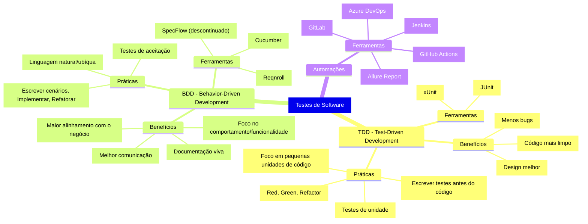

# BDD-DotNet8-2024-11
Conteúdos de apresentação sobre BDD com .NET apresentados no dia 07/11/2024.

---

## Mapa mental TDD x BDD

```mermaid
mindmap
  root["Testes de Software"]
    TDD - Test-Driven Development
      Benefícios
        Benef1["Código mais limpo"]
        Benef2["Menos bugs"]
        Benef2["Design melhor"]
      Práticas
        Prat1["Red, Green, Refactor"]
        Prat2["Escrever testes antes do código"]
        Prat3["Testes de unidade"]
        Prat4["Foco em pequenas unidades de código"]
      Ferramentas
        Ferr1["JUnit"]
        Ferr2["xUnit"]
    BDD - Behavior-Driven Development
      Benefícios
        Benef1["Melhor comunicação"]
        Benef2["Foco no comportamento/funcionalidade"]
        Benef3["Documentação viva"]
        Benef4["Maior alinhamento com o negócio"]
      Práticas
        Prat1["Escrever cenários, Implementar, Refatorar"]
        Prat2["Linguagem natural/ubíqua"]
        Prat3["Testes de aceitação"]
      Ferramentas
        Ferr1["Cucumber"]
        Ferr2["SpecFlow (descontinuado)"]
        Ferr3["Reqnroll"]
    Automações
      Ferramentas
        Ferr1["Azure DevOps"]
        Ferr2["Jenkins"]
        Ferr3["GitLab"]
        Ferr4["GitHub Actions"]
        Ferr5["Allure Report"]
```
